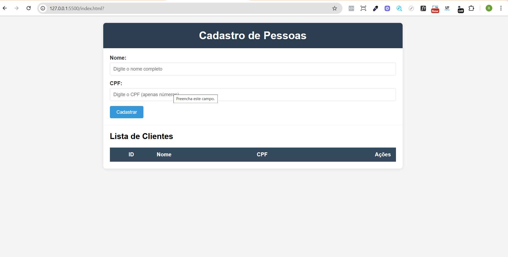
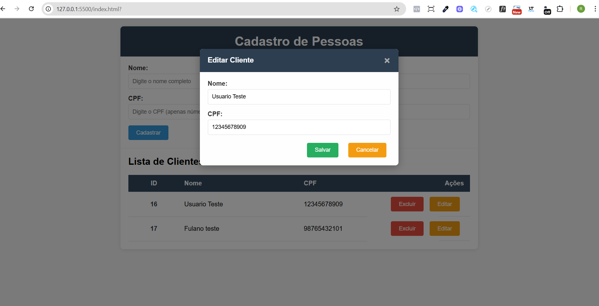
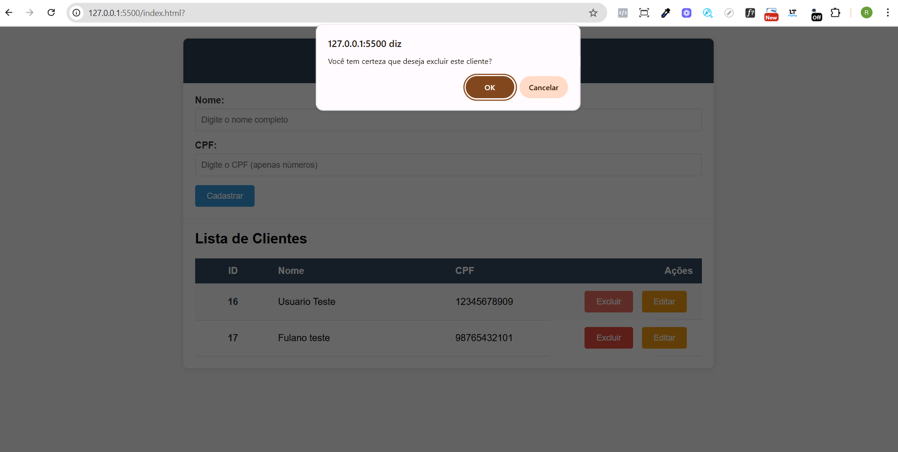
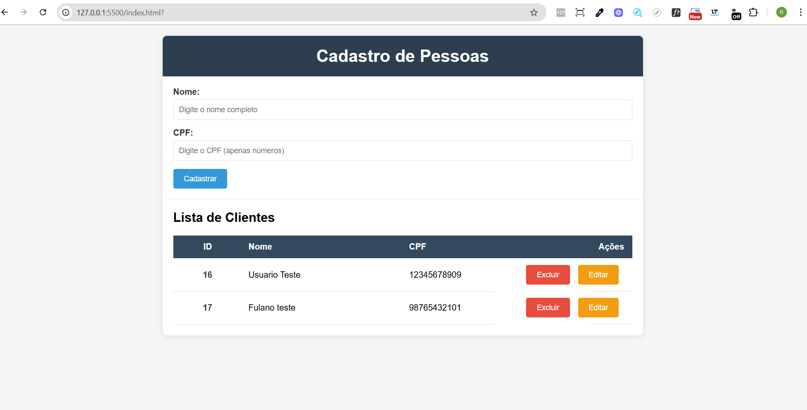

# 📋 Sistema de Cadastro de Pessoas

<div align="center">


</div>

## 🚀 Sobre o Projeto

Um sistema completo de **CRUD (Create, Read, Update, Delete)** para cadastro de pessoas, desenvolvido com tecnologias modernas e interface responsiva. O sistema permite gerenciar registros de clientes de forma eficiente e intuitiva.

<div align="center">



*Sistema de Cadastro de Pessoas - Interface completa e funcional*

</div>

### ✨ Funcionalidades Principais

- ✅ **Cadastro de Clientes** - Adicionar novos registros com nome e CPF
- ✅ **Listagem Dinâmica** - Visualizar todos os clientes em tabela responsiva
- ✅ **Edição em Modal** - Editar dados através de interface moderna
- ✅ **Exclusão Segura** - Deletar registros com confirmação
- ✅ **Validações** - Verificação de campos obrigatórios
- ✅ **Feedback Visual** - Mensagens de sucesso e erro
- ✅ **Interface Responsiva** - Funciona em desktop e mobile

## 🛠️ Tecnologias Utilizadas

### Backend
- **Node.js** - Runtime JavaScript
- **Express.js** - Framework web
- **MySQL** - Banco de dados
- **MySQL2** - Driver MySQL para Node.js
- **CORS** - Cross-Origin Resource Sharing

### Frontend
- **HTML5** - Estrutura da página
- **CSS3** - Estilização moderna e responsiva
- **JavaScript (ES6+)** - Funcionalidades interativas
- **Fetch API** - Comunicação com backend

## 📋 Pré-requisitos

Antes de começar, você precisa ter instalado:

- [Node.js](https://nodejs.org/) (versão 14 ou superior)
- [MySQL](https://www.mysql.com/) (versão 5.7 ou superior)
- [Git](https://git-scm.com/) (para clonar o repositório)

## 🔧 Instalação

### 1. Clone o repositório
```bash
git clone https://github.com/seu-usuario/sistema-cadastro-pessoas.git
cd sistema-cadastro-pessoas
```

### 2. Instale as dependências
```bash
npm install
```

### 3. Configure o banco de dados

Execute o script SQL para criar o banco e a tabela:

```sql
-- Execute o arquivo tabela.sql no seu MySQL
create database cadastro;
use cadastro;

create table cliente(
    id int auto_increment primary key,
    nome varchar(50) not null,
    cpf varchar(11) not null unique
);
```

### 4. Configure as credenciais do banco

Edite o arquivo `bd.js` com suas credenciais:

```javascript
const conexao = mysql.createConnection({
    host: 'localhost',
    user: 'seu_usuario',
    password: 'sua_senha',
    database: 'cadastro'
});
```

### 5. Execute o projeto
```bash
npm run dev
```

O servidor estará rodando em: `http://localhost:3002`

## 🎯 Como Usar

### Cadastrar Cliente
1. Preencha o campo **Nome** com o nome completo
2. Digite o **CPF** (apenas números)
3. Clique em **"Cadastrar"**

### Editar Cliente
1. Clique no botão **"Editar"** na linha desejada
2. O modal abrirá com os dados preenchidos
3. Modifique os campos necessários
4. Clique em **"Salvar"**

### Excluir Cliente
1. Clique no botão **"Excluir"** na linha desejada
2. Confirme a exclusão na caixa de diálogo

## 📁 Estrutura do Projeto

```
sistema-cadastro-pessoas/
├── index.html          # Interface principal
├── style.css           # Estilos CSS
├── acoes.js            # JavaScript das funcionalidades
├── index.js            # Servidor Express
├── bd.js              # Configuração do banco de dados
├── tabela.sql         # Script de criação do banco
├── package.json       # Dependências do projeto
└── README.md          # Este arquivo
```

## 🔌 API Endpoints

| Método | Endpoint | Descrição |
|--------|----------|-----------|
| GET | `/cliente` | Lista todos os clientes |
| POST | `/cliente` | Cadastra novo cliente |
| PUT | `/cliente/:id` | Atualiza cliente existente |
| DELETE | `/cliente/:id` | Remove cliente |

### Exemplo de uso da API

```javascript
// Cadastrar cliente
fetch('http://localhost:3002/cliente', {
    method: 'POST',
    headers: { 'Content-Type': 'application/json' },
    body: JSON.stringify({ nome: 'João Silva', cpf: '12345678901' })
});

// Listar clientes
fetch('http://localhost:3002/cliente')
    .then(response => response.json())
    .then(clientes => console.log(clientes));
```

## 🎨 Interface

### Screenshots do Sistema

<div align="center">

#### 📋 Tela Principal - Lista de Clientes

*Interface principal com formulário de cadastro e tabela de clientes*

#### ✏️ Modal de Edição

*Modal para editar dados do cliente com campos preenchidos*

#### 🗑️ Confirmação de Exclusão

*Pop-up de confirmação antes de excluir um cliente*

#### 📝 Tabelas Preenchidas

*Tabela com dados cadastrados e botões de ação*

</div>

### Características do Design
- **Layout Responsivo** - Adapta-se a diferentes tamanhos de tela
- **Cores Modernas** - Paleta de cores profissional
- **Animações Suaves** - Transições elegantes
- **Modal Interativo** - Edição em janela flutuante
- **Feedback Visual** - Mensagens de status claras

### Componentes
- **Formulário de Cadastro** - Campos para nome e CPF
- **Tabela Dinâmica** - Lista de clientes com ações
- **Modal de Edição** - Interface para modificar dados
- **Sistema de Alertas** - Notificações de sucesso/erro

## 🚀 Deploy

### Para produção, considere:

1. **Variáveis de Ambiente**
```bash
DB_HOST=seu_host
DB_USER=seu_usuario
DB_PASSWORD=sua_senha
DB_NAME=cadastro
PORT=3002
```

2. **Segurança**
- Implementar autenticação
- Validar inputs
- Usar HTTPS
- Configurar CORS adequadamente

3. **Performance**
- Implementar cache
- Otimizar queries
- Usar CDN para assets

## 🤝 Contribuindo

1. Faça um Fork do projeto
2. Crie uma Branch para sua Feature (`git checkout -b feature/AmazingFeature`)
3. Commit suas mudanças (`git commit -m 'Add some AmazingFeature'`)
4. Push para a Branch (`git push origin feature/AmazingFeature`)
5. Abra um Pull Request

## 📝 Licença

Este projeto está sob a licença MIT. Veja o arquivo [LICENSE](LICENSE) para mais detalhes.

## 👨‍💻 Autor

**Seu Nome**
- GitHub: [@seu-usuario](https://github.com/seu-usuario)
- LinkedIn: [Seu LinkedIn](https://linkedin.com/in/seu-perfil)

## 🙏 Agradecimentos

- Comunidade Node.js
- Stack Overflow
- Documentação do Express.js
- Tutoriais de MySQL

---

<div align="center">

⭐ **Se este projeto te ajudou, deixe uma estrela!** ⭐

</div>